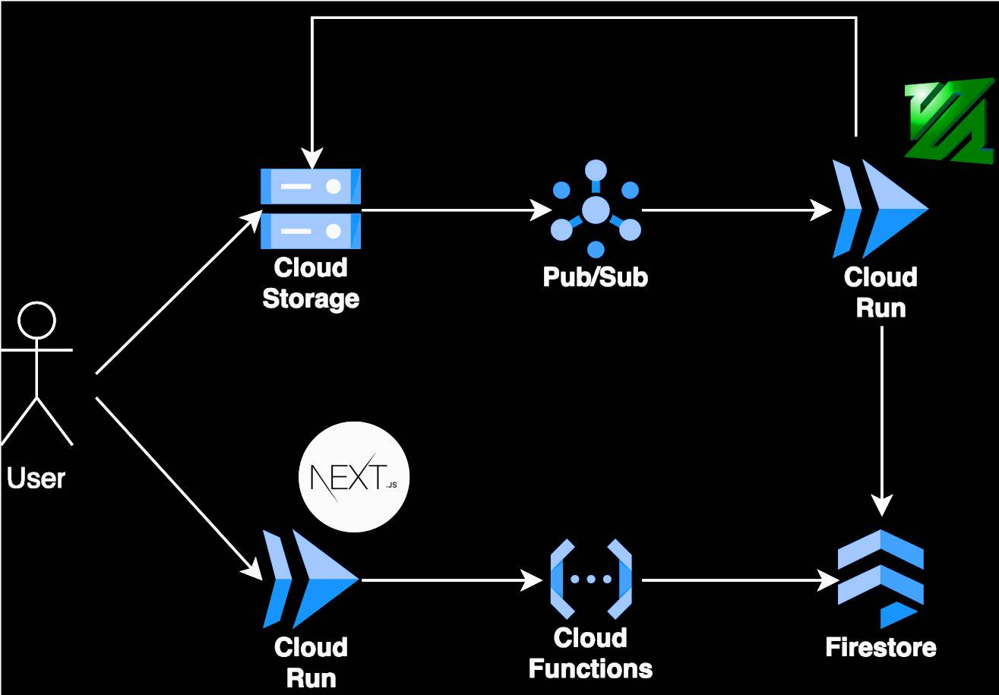

# Youtube Skeleton Design

## Introduction
This document designs a simple `YouTube` clone.

The purpose of this project isn't to create an exact replica of YouTube, but to develop a basic framework that implements its key features.

My aim is to maintain a straightforward design, considering some scalability compromises and focus on understanding the principles, not creating a system ready for production.

## Background
YouTube is an online platform where users can upload, view, like, comment, and share videos.

The scale of these features on YouTube is enormous; even basic actions like liking and commenting happen billions of times each day. The primary objective, therefore, is to design a simple system while also considering some scalability challenges.

## Requirements
- Users can sign in and out using their Google Account.
- Authenticated users can upload videos to the platform.
- All users, whether signed in or not, can browse and view a list of uploaded videos.
- All users can watch individual videos, regardless of whether they are signed in.
- Uploaded videos must be transcoded into multiple formats (e.g., 360p, 720p) to ensure compatibility across various devices and network conditions.

## High Level Design

### Cloud Storage - Video Storage
Cloud storage is simple, scalable and cost effective solution designed for sotring and serving large files. It will be used for storing raw and processed videos.

### Cloud Pub / Sub
When a video is uploaded, a message will be published to a Cloud Pub/Sub topic. This approach enables asynchronous video processing and adds a durability layer, ensuring that upload requests are only removed from the Pub/Sub system after they've been successfully processed.

### Cloud Run - Video Processing Workers
To reduce the load on the primary server, which focuses on handling user requests, a dedicated Cloud Run instance will be used for asynchronous processing of uploaded videos. Upon receiving a message from Pub/Sub, a video processing worker will transcode the uploaded video

[FFMPEG](https://ffmpeg.org/) will be used for transcoding the videos. It is popular open-source, cross-platform solution for processing videos.

### Firestore - Video Metadata
After a video is processed, all its metadata will be stored in Firestore. This enables the Web Application to display processed videos along with their basic information, such as title and description.

### Firebase Function - Videos API
To get started Videos API will allow users to upload and retreive videos metadata (Can be easily extended in the future by adding more CRUD operations).

### Cloud Run - Web Application
For building web application an Angular will be used.

### Firebase Auth - Authentication
This will allow for easy integration with Google Sign In.

## Detailed Design

### User Sign Up
Users can sign up with their Google Account, which is facilitated by Firebase Auth. A record will be created that includes a uniquely generated ID and the user's email address.

To store additional user information, a Firestore document will be created for each user as part of the "users" collection. This document can easily accommodate additional information such as the user's name, profile picture, and other relevant details.

Firebase Auth will be integrated into the client-side code, and the creation of user documents will be triggered using [Firebase Auth Triggers](https://firebase.google.com/docs/functions/auth-events). It's not recommended to create these user documents from the client side, as this approach could lead to errors (such as browser crashes or network issues) and result in inconsistencies.

### Video Upload
As a policy, only authenticated users are allowed to upload videos to the platform. This approach ensures that each video can be associated with the user who uploaded it, which helps track the number of videos each user uploads, allowing for quota management or the collection of usage statistics.

To prevent unauthorized access to the upload functionality, a Signed URL will be generated, enabling users to upload videos directly to Cloud Storage. A Firebase function will be responsible for checking whether the user is authenticated before generating the Signed URL.

| **Remember** - The Signed URL must be generated after the user has specified the video file to upload. This is because the URL generation process requires knowledge of the video file's extension.

### Video Processing
We aim to create a scalable solution for video processing. Ideally, we would process videos as soon as they are uploaded, but what happens if there's a sudden influx of a large number of videos? In that scenario, our system could become overloaded, leading to timeouts and data loss due to excessive traffic.

To address this issue, we'll use Google Pub/Sub as a message queue.

1. **Decoupling Processing from Uploads:** When a video is uploaded, a message is published to a Pub/Sub topic, decoupling the processing logic from the upload event.

2. **Message Handling and Scalability:** Each message is then pushed to a message worker for processing. This approach also allows for future flexibility, such as applying the Fan-Out pattern to forward messages to analytical services or other extensions.

3. **Buffering and Load Management:** If many videos are uploaded simultaneously, we don't want to overload our servers. Pub/Sub buffers the incoming messages (video uploads), enabling us to scale our workers as needed. If the buffer grows too large, we can increase the number of runners to handle the load.

When a video is processed, it is uploaded to a public Cloud Storage Bucket, and its metadata is stored in Firestore. The metadata also includes the processing status, allowing us to display the processed video on the web.

### References

- [Firebase Auth](https://firebase.google.com/docs/auth)
- [Firebase Triggers](https://firebase.google.com/docs/functions/auth-events)
- [Cloud Storage Signed URLs](https://cloud.google.com/storage/docs/access-control/signed-urls)
- [Pub/Sub Push subscriptions](https://cloud.google.com/pubsub/docs/push)
- [Using Pub/Sub with Cloud Storage](https://cloud.google.com/storage/docs/pubsub-notifications)
- [Using Pub/Sub with Cloud Run](https://cloud.google.com/run/docs/tutorials/pubsub)